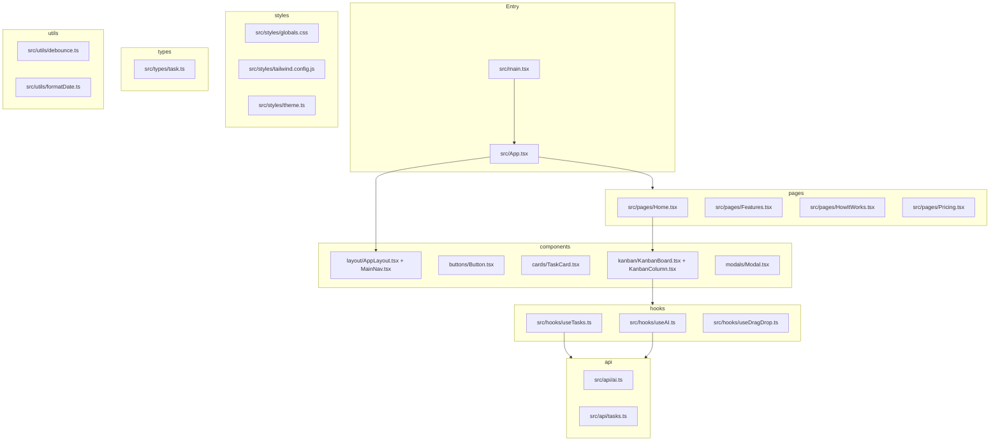

# AI Task Board — фактическая схема проекта

## Точка входа и маршрутизация

| Файл | Роль |
|------|------|
| [index.html](index.html) | Подключает `/src/main.tsx` |
| [src/main.tsx](src/main.tsx) | `createRoot`, `StrictMode`, обёртка `BrowserRouter`, импорт глобальных стилей |
| [src/App.tsx](src/App.tsx) | `Routes` / `Route`: вложенные маршруты под [src/components/layout/AppLayout.tsx](src/components/layout/AppLayout.tsx) |
| [src/components/layout/MainNav.tsx](src/components/layout/MainNav.tsx) | `NavLink`: `/`, `/features`, `/how-it-works`, `/pricing` |

Страницы: [src/pages/Home.tsx](src/pages/Home.tsx), [Features.tsx](src/pages/Features.tsx), [HowItWorks.tsx](src/pages/HowItWorks.tsx), [Pricing.tsx](src/pages/Pricing.tsx).

## Дерево `src/` (по файлам)

## Сборка и тесты

| Файл | Роль |
|------|------|
| [vite.config.ts](vite.config.ts) | Vite + React plugin, alias `@` → `src` |
| [vitest.config.ts](vitest.config.ts) | `mergeConfig` с Vite; jsdom, RTL setup |
| [postcss.config.js](postcss.config.js) | Tailwind с конфигом [src/styles/tailwind.config.js](src/styles/tailwind.config.js) |
| [src/test/setup.ts](src/test/setup.ts) | `@testing-library/jest-dom` для Vitest |

Команды: `npm run dev`, `npm run build`, `npm run test`.

## Зависимости (кратко)

React 18 + TypeScript, Tailwind 3, Zustand, `@dnd-kit`, Framer Motion, Axios, React Router 7, Vitest + React Testing Library (в правилах упомянут Jest; в проекте используется Vitest как принято для Vite).

## Переменные окружения (опционально)

`VITE_AI_ENDPOINT`, `VITE_AI_API_KEY` — см. [src/vite-env.d.ts](src/vite-env.d.ts) и [src/api/ai.ts](src/api/ai.ts).
